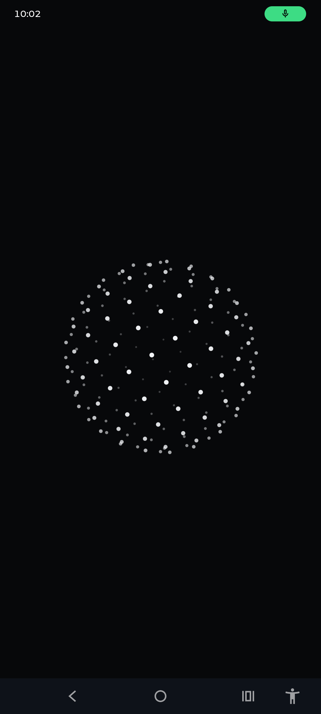
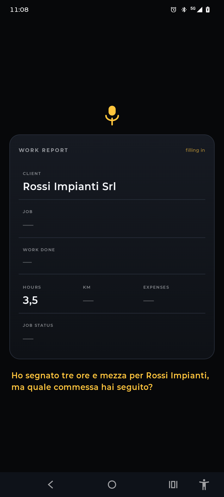
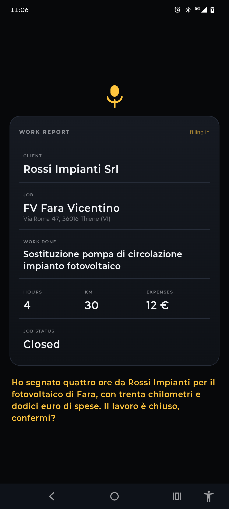

# Wisper

An Android app that lets an industrial technician file the daily work report by
talking, without ever touching the phone. You say "Wisper", you tell it about
your day, the fields fill themselves in on screen, you say "confermo", and the
row lands in the company spreadsheet.

It speaks Italian, because that is who it was built for.

| At rest | Half a sentence in | The whole day |
|---|---|---|
|  |  |  |
| Waiting for the wake word. Nothing has been touched. | A dash is a field Wisper does not know yet, and it asks for one thing at a time. | Client, job, address, hours, kilometres, expenses, and whether the job closes. |

The labels follow the phone's language. Wisper still speaks Italian, because
the technicians it was built for do.

## Why it exists

My father runs a technical firm in northern Italy. I have been building software
for its clients for the past few months, which is how I ended up watching this
particular problem from close up.

His technicians spend the day on site with gloves on and both hands busy. Then
the report has to be filed: client, job, what they did, hours, kilometres,
expenses, whether the work is finished.

The interesting part is when it happens. Back at the office, near closing time,
at the end of a day that started at seven, by someone who is tired and wants to
go home. It is a form, filled in by hand, one field after another, and nothing
about it is automatic. So it gets rushed, or written from memory two days later,
or forgotten, and the office spends the next morning chasing it.

The constraint was fixed before any code existed: gloves, dirty hands, a ladder.
Anything that needs a screen has already lost.

## One turn, end to end

Wake word, beep, then you talk. The model pulls the fields out of ordinary
speech; "tre ore e mezza" becomes 3.5, "mezza giornata" becomes 4, "esse pi
emme" becomes SPM Srl. Corrections work mid sentence: say "no, aspetta, erano
due ore" and it changes. When you are done it reads the whole report back, you
confirm, and it saves.

It also lists a client's open jobs on request, telling them apart by where they
are; creates new clients and jobs by voice and says so out loud; and closes a job
in the company sheet when you say the work is finished, so it stops being offered
tomorrow.

## The two rules

**One microphone owner at a time.** The wake word and the recogniser alternate,
they never overlap. Two clients on one microphone do not throw an error on
Android, they return silence, and you spend the afternoon debugging the network
instead.

**What you hear is what gets saved.** The final read back is built from the
stored fields, not written by the model. Earlier it would announce "forty
kilometres" with the kilometres field empty, and on a work report that is the
worst thing that can happen: the technician is not looking at the screen, he
hears it confirmed, and the number does not exist.

The same lesson kept coming back. "Ho finito" in Italian means both "I have
finished speaking" and "the job is finished", and the model kept closing jobs
that had just been declared open. Prompting did not fix it; a rule in the code
did. Things that must never be wrong do not get asked of a model politely.

## Sharing the microphone

A wake word means holding the microphone open forever, and on Android the
microphone belongs to whoever grabbed it. With a foreground service running all
day, Wisper won every time and the rest of the phone went deaf: voice notes,
video, calls, the Google assistant, all of it silently broken, and by us.

The rule now is one line. Wisper listens when the screen is off, or when Wisper
is the app you are looking at. Use the phone for anything else, or take a call,
and it steps aside on its own and says so in its notification.

Those two situations never overlap. The case Wisper exists for is a technician
with the phone in his pocket and his hands busy, which is screen off. Every case
where it used to steal the microphone had the screen on and another app in front.
Calls are handled separately, because a phone against your ear has the screen off
just like a pocket does; those are read from the system audio mode.

## Stack

Kotlin, native Android, minSdk 26, Jetpack Compose. Vosk for the wake word,
running entirely on the device: until the word is heard no audio leaves the
phone and no connection is needed. Android's own recogniser for dictation,
Gemini over REST for the reasoning, with a fixed response schema so the model
has to return the report fields and cannot drift into prose. System
text to speech for the voice, with the Italian voice chosen by measuring the
available ones instead of taking the default.

The whole loop lives in a foreground service, so it keeps listening with the app
closed. A Google Apps Script bound to the spreadsheet is the bridge: the app
posts a report, the script appends the row and hands back the client and job
lists.

## Building it

The Vosk Italian model is not in this repository; it is 88 MB and it belongs to
alphacephei. Download it and unpack it into the assets folder:

```
https://alphacephei.com/vosk/models/vosk-model-small-it-0.22.zip
  -> app/src/main/assets/modello-it/
```

Add a `uuid` file inside that folder with any fixed string in it; Vosk uses it to
tell whether the model changed.

Keys live outside the repository, in `C:\Users\andre\wisper-keys\wisper.properties`:

```
sheetUrl=https://script.google.com/macros/s/.../exec
aiKey=...
```

Without that file the project still compiles. The keys become empty strings and
the parts that need them switch themselves off, which is deliberate: the build
should never break because a key is missing.

The Apps Script that goes in the spreadsheet is in `apps-script/Code.gs`.

## Things worth knowing

**Single user.** There is no login. The app writes to one spreadsheet, its
owner's. A real version needs accounts, one workspace per company, and
permissions per technician.

**The spreadsheet endpoint is unprotected.** It is a public Apps Script URL;
anyone holding it can append a row.

**It needs a connection to understand you.** The wake word is fully offline, the
reasoning and the save are not. On a site with no signal Wisper wakes up and
cannot yet hold the report for later. That queue is the next thing to build.

**Noise degrades accuracy.** Published Italian speech recognition benchmarks sit
around 3% word error, measured on clean studio audio. On a real building site,
expect meaningfully worse. This is the honest weak point of the whole idea.

**There is no APK to download, on purpose.** The model key would travel inside
it and anyone could pull it back out. Gemini keys cannot be locked to an Android
package the way Maps keys can, so the only real fix is a server holding the key
and the app asking that server. That server is not built yet, so the app is
source only and you build it with your own key.

## Where it goes

A spreadsheet is where this starts, not where it ends. The next step is writing
into the system a firm already runs, an ERP like Odoo, so the report lands as a
timesheet entry against the right job instead of a row somebody copies over by
hand.

Then the two things a report is actually used for.

**Signatures.** The surveyor's is signed once and kept in Drive. The client signs
on the phone there and then, offered only when the job is being closed, because a
signature on unfinished work means nothing.

**Receipts.** Photograph it, read it with OCR, attach it to the expense. Right
now an expense is a number somebody said out loud and the accountant takes it on
trust.

Before any of that, the offline queue, one account per technician, a real token
on the spreadsheet endpoint, and a server holding the model key.

## How this was built

I ship products with AI. The product and design calls are mine, the code is
Claude's. My job here was deciding what the app should do and what it should
refuse to do, using it until something felt wrong, and directing the fix.

Several features exist because I used it and it annoyed me. It used to keep
listening after I turned the screen off and picked up other people's
conversations. It closed a job in the sheet when I said "ho finito", meaning I
had finished speaking. It read me a summary I already knew with no way to cut it
short. None of those came out of automated testing; they came out of being the
person holding the phone.

Field feedback from Manuel Gasparotto, Studio Tecnico GM, the surveyor whose
technicians this was built for.

Built for NGN Hacks 2026.
